# Media Tracker - Gestor de Películas, Series y Juegos

Aplicación full stack para registrar contenido multimedia visto y por ver, con autenticación local y OAuth (Google y GitHub), roles de usuario/admin y paneles dedicados.

## 🧰 Tecnologías utilizadas

### Backend
- Node.js + Express ([`server.js`](application/backend/server.js))
- MySQL (`mysql2`) para persistencia de usuarios y contenido ([`database.js`](application/backend/src/config/database.js))
- JWT para autenticación stateless ([`authController.js`](application/backend/src/controllers/authController.js))
- Cookies seguras con [`cookie-parser`](application/backend/package.json)
- OAuth 2.0 con Passport:
  - Google: `passport-google-oauth20`
  - GitHub: `passport-github2`
  ([`passport.js`](application/backend/src/config/passport.js))
- Pruebas unitarias con Jest ([`authController.test.js`](application/backend/tests/authController.test.js))

### Frontend
- React 19 + Vite ([`package.json`](application/frontend/package.json))
- Enrutamiento con React Router DOM ([`App.jsx`](application/frontend/src/App.jsx))
- Manejo de estado con hooks (`useState`, `useEffect`, `useMemo`) en páginas y componentes ([`DashboardView.jsx`](application/frontend/src/pages/DashboardView.jsx))
- Estilos con CSS personalizado ([`App.css`](application/frontend/src/styles/App.css))

---

## 🏗️ Backend y API (explicación completa)

### 1) Arquitectura general del backend
El servidor se inicializa en [`server.js`](application/backend/server.js), donde se configura:
- CORS con lista blanca de orígenes desde [`oauth.js`](application/backend/src/config/oauth.js).
- Parseo de JSON/formularios y cookies.
- Inicialización de Passport.
- Registro de rutas:
  - `/api/auth` → [`authRoutes.js`](application/backend/src/routes/authRoutes.js)
  - `/api/media` → [`mediaRoutes.js`](application/backend/src/routes/mediaRoutes.js)
  - `/api/admin` → [`adminRoutes.js`](application/backend/src/routes/adminRoutes.js)

Además expone:
- `GET /api/health` (estado del servicio)
- `GET /api` (resumen de endpoints)

### 2) Autenticación local (registro/login)
En [`authController.register()`](application/backend/src/controllers/authController.js:112) se valida la entrada, se verifica duplicidad de usuario/email, se hashea contraseña con bcrypt y se genera token JWT.

En [`authController.login()`](application/backend/src/controllers/authController.js:173) se valida credenciales, se compara hash de contraseña y se retorna token + perfil.

Ambos flujos llaman internamente a:
- [`issueTokenAndSetCookie()`](application/backend/src/controllers/authController.js:104)
- [`setAuthCookie()`](application/backend/src/controllers/authController.js:20)

Esto permite autenticación por:
- Header `Authorization: Bearer <token>`
- Cookie `auth_token`

El middleware [`authMiddleware`](application/backend/src/middleware/auth.js) soporta ambos mecanismos.

### 3) API de medios
Todas las rutas de medios están protegidas con middleware JWT en [`mediaRoutes.js`](application/backend/src/routes/mediaRoutes.js:6):

| Método | Endpoint | Descripción |
|---|---|---|
| GET | `/api/media` | Lista ítems del usuario autenticado |
| GET | `/api/media/:id` | Obtiene un ítem por ID |
| POST | `/api/media` | Crea nuevo ítem |
| PUT | `/api/media/:id` | Actualiza estado/rating u otros campos |
| DELETE | `/api/media/:id` | Elimina ítem |

### 4) API de administración
Las rutas de admin requieren 2 capas:
1. JWT válido (`authMiddleware`)
2. Rol admin (`requireAdmin`)

Implementado en [`adminRoutes.js`](application/backend/src/routes/adminRoutes.js:7).

Endpoints:
- `GET /api/admin/users`
- `DELETE /api/admin/users/:id`

---

## 🔐 Login con Google y GitHub (OAuth 2.0)

### Flujo OAuth implementado
1. Frontend redirige al backend:
   - Google: `GET /api/auth/google`
   - GitHub: `GET /api/auth/github`
   (disparado desde [`handleOAuthLogin()`](application/frontend/src/pages/Login.jsx:25)).

2. Backend inicia estrategia Passport:
   - Google/GitHub en [`authRoutes.js`](application/backend/src/routes/authRoutes.js)
   - Estrategias definidas en [`passport.js`](application/backend/src/config/passport.js)

3. Proveedor OAuth autentica y redirige al callback:
   - `/api/auth/google/callback`
   - `/api/auth/github/callback`

4. En callback:
   - Se ejecuta [`findOrCreateOAuthUser()`](application/backend/src/controllers/authController.js:55)
   - Se emite JWT por [`issueTokenAndSetCookie()`](application/backend/src/controllers/authController.js:104)
   - Se redirige al frontend según rol (`/dashboard` o `/admin`) con token en query.

5. Frontend consume query token y lo guarda en `localStorage` en [`useEffect()`](application/frontend/src/pages/DashboardView.jsx:136).

### Variables de entorno clave para OAuth
Definidas/consumidas en [`oauth.js`](application/backend/src/config/oauth.js) y [`passport.js`](application/backend/src/config/passport.js):
- `GOOGLE_CLIENT_ID`
- `GOOGLE_CLIENT_SECRET`
- `GITHUB_CLIENT_ID`
- `GITHUB_CLIENT_SECRET`
- `BACKEND_URL`
- `FRONTEND_URL` / `FRONTEND_URL_LOCAL`

Si faltan credenciales OAuth, las rutas responden error controlado (Google/GitHub no configurado).

---

## 🖥️ Frontend (explicación detallada)

### 1) Estructura y navegación
La app monta React en [`main.jsx`](application/frontend/src/main.jsx) y define rutas en [`App.jsx`](application/frontend/src/App.jsx):
- `/login`
- `/register`
- `/dashboard`
- `/admin`

Se usa [`BrowserRouter`](application/frontend/src/App.jsx:10), [`Routes`](application/frontend/src/App.jsx:11) y [`Route`](application/frontend/src/App.jsx:12).

### 2) Pantallas principales
- Login: [`Login.jsx`](application/frontend/src/pages/Login.jsx)
  - Login por usuario/email + password
  - Botones OAuth para Google y GitHub
- Registro: [`Register.jsx`](application/frontend/src/pages/Register.jsx)
- Dashboard de usuario: [`DashboardView.jsx`](application/frontend/src/pages/DashboardView.jsx)
- Dashboard admin: [`AdminDashboard.jsx`](application/frontend/src/pages/AdminDashboard.jsx)

### 3) Estado de aplicación y React Context
En esta versión **no hay un contexto global con React Context API** (no existe [`createContext()`](application/frontend/src/App.jsx:8) ni `useContext` en el código actual).

El estado se maneja de forma local por pantalla/componente usando hooks:
- Formularios y errores en login/registro con `useState`.
- Datos de medios, modales, filtros y estado de carga en [`DashboardView.jsx`](application/frontend/src/pages/DashboardView.jsx).

Patrón usado:
- Estado local por dominio de UI (form, loading, error, modal).
- Persistencia de sesión en `localStorage` (`token`).
- Peticiones HTTP centralizadas por URL base con [`buildApiUrl()`](application/frontend/src/lib/api.js:10).

### 4) Componentes reutilizables
- Botón con comportamiento API configurable: [`ButtonComponent`](application/frontend/src/components/ButtonComponent.jsx)
- Barra superior y logout: [`Navbar`](application/frontend/src/components/Navbar.jsx)
- Tabs y tablas del dashboard en componentes desacoplados (`DashboardTabs`, `MediaSection`, `MediaTable`).

### 5) Navegación con router
Se utiliza:
- [`useNavigate()`](application/frontend/src/pages/Login.jsx:8) y [`useNavigate()`](application/frontend/src/pages/Register.jsx:7) para transiciones programáticas.
- Redirección automática raíz → login con [`Navigate`](application/frontend/src/App.jsx:12).

---

## 🧪 Pruebas con Jest (unitarias, funcionales y seguridad)

El backend usa Jest para validar autenticación, autorización por rol y protección de rutas.

### Cómo ejecutar las pruebas

Desde [`application/backend`](application/backend):

```bash
npm test -- --runInBand
```

Scripts disponibles en [`package.json`](application/backend/package.json):
- `npm test`
- `npm run test:watch`
- `npm run test:coverage`

### Suite 1: Controlador de autenticación (unitarias)

Archivo: [`authController.test.js`](application/backend/tests/authController.test.js)

Valida la lógica de [`register()`](application/backend/src/controllers/authController.js:112), [`login()`](application/backend/src/controllers/authController.js:173) y [`getMe()`](application/backend/src/controllers/authController.js:231), incluyendo:

- Validación de campos requeridos (`400`) en registro/login.
- Detección de usuario existente (`409`) en registro.
- Registro exitoso (`201`) con emisión de token JWT y cookie de sesión.
- Login fallido por credenciales inválidas (`401`).
- Login exitoso con retorno de usuario + token + cookie.
- Obtención de perfil autenticado y manejo de usuario inexistente (`404`).

> Nota técnica: se mockea la base de datos para aislar la lógica del controlador y convertir estas pruebas en unitarias puras.

### Suite 2: Middleware JWT (seguridad de autenticación)

Archivo: [`authMiddleware.test.js`](application/backend/tests/authMiddleware.test.js)

Valida el comportamiento de [`authMiddleware`](application/backend/src/middleware/auth.js:6):

- Rechaza requests sin token (`401`).
- Rechaza formatos inválidos de `Authorization` (`401`).
- Acepta token válido por header Bearer.
- Acepta token válido por cookie `auth_token`.
- Rechaza token inválido (`401`).
- Rechaza token expirado (`401`).

Estas pruebas cubren escenarios clave de seguridad de autenticación y manejo de errores en rutas protegidas.

### Suite 3: Middleware de rol admin (autorización)

Archivo: [`requireAdmin.test.js`](application/backend/tests/requireAdmin.test.js)

Valida la lógica de [`requireAdmin`](application/backend/src/middleware/requireAdmin.js:1):

- Bloquea acceso si no existe usuario autenticado (`403`).
- Bloquea acceso si el rol no es `admin` (`403`).
- Permite acceso cuando el rol sí es `admin`.

### Suite 4: Control de acceso a recursos de media (funcionales + seguridad)

Archivo: [`mediaController.authorization.test.js`](application/backend/tests/mediaController.authorization.test.js)

Valida reglas de autorización sobre rutas protegidas de medios en [`mediaController.getById()`](application/backend/src/controllers/mediaController.js:109) y [`mediaController.update()`](application/backend/src/controllers/mediaController.js:135):

- Un usuario regular no puede consultar un ítem que pertenece a otro usuario (`403`).
- Un usuario regular no puede actualizar ítems de otro usuario (`403`).
- Un administrador sí puede consultar recursos de otros usuarios (control administrativo).

Esta suite fortalece la protección contra acceso horizontal indebido (IDOR) y verifica que las políticas de rol/propiedad se cumplan.

### Resumen de cobertura actual

- **Unitarias**: lógica de autenticación y perfil.
- **Funcionales (backend)**: flujo de autorización en controladores/middlewares críticos.
- **Seguridad**: pruebas de autenticación JWT, expiración de token, validación de formato y autorización por rol/propiedad.

Con esto se asegura robustez en las rutas protegidas y se reduce el riesgo de accesos no autorizados.

---

## 📸 Capturas de pantalla de la aplicación

Las evidencias visuales se encuentran en la carpeta [`screenshots`](screenshots) y están ordenadas por flujo funcional.

### 1) Inicio de sesión y registro (usuario)

1. **Pantalla de login inicial**: formulario de acceso y botones de autenticación.

   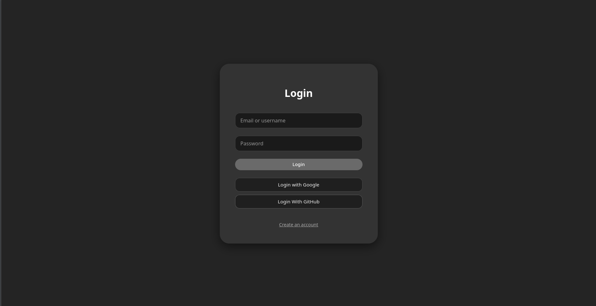

2. **Pantalla de registro**: alta de nuevo usuario con validación de campos.

   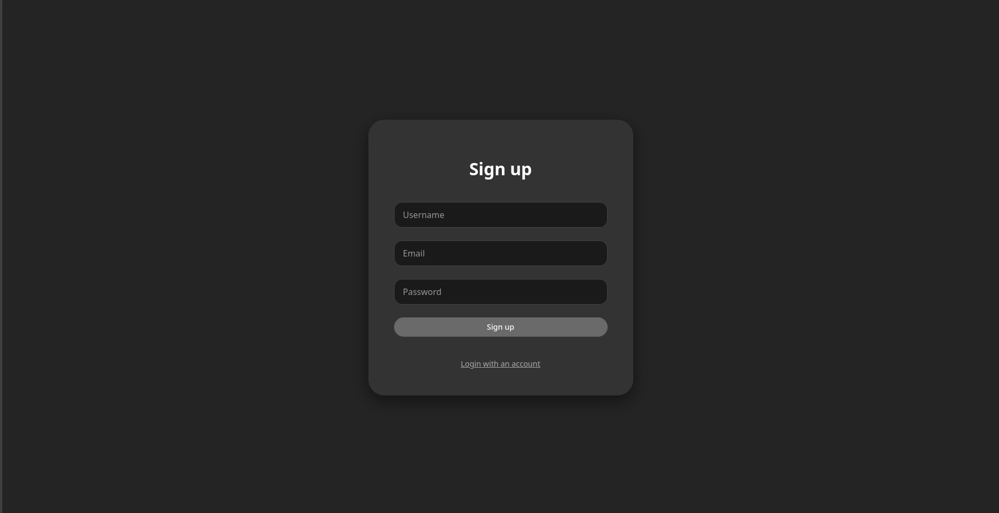

3. **Proceso de registro exitoso**: confirmación de creación de cuenta.

   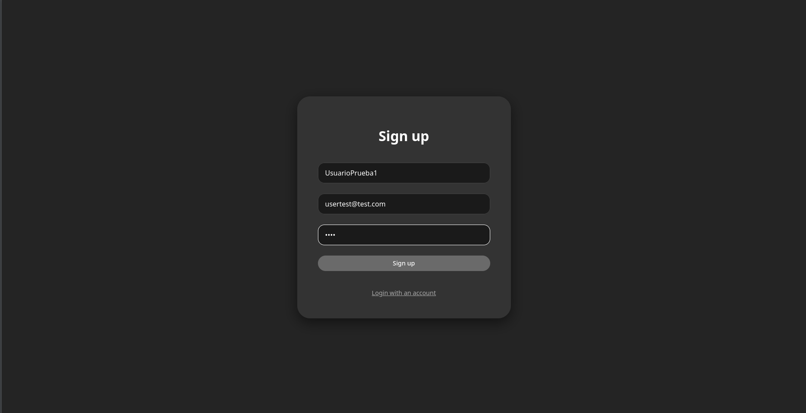

4. **Inicio de sesión con cuenta creada**: autenticación correcta y redirección al dashboard.

   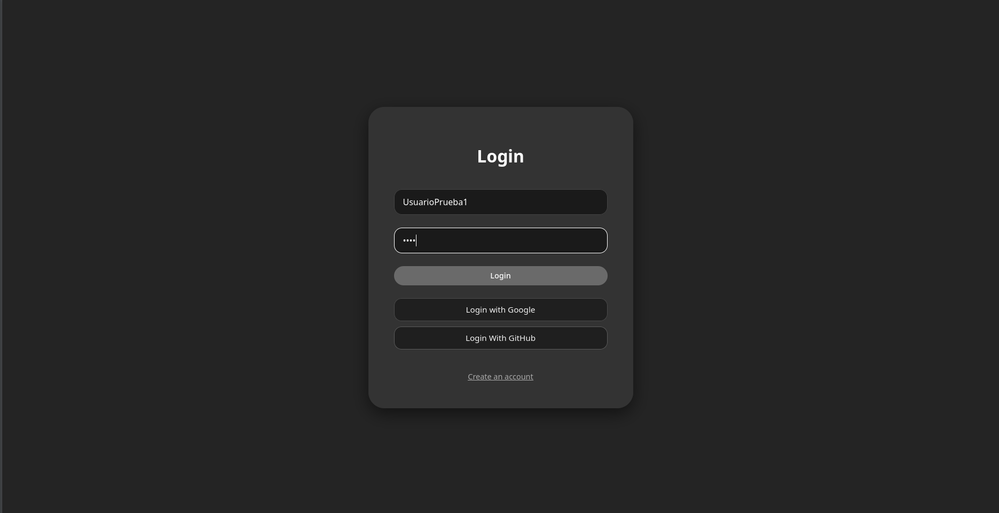

### Evidencia en video de OAuth

- **Login con Google**: flujo completo de autenticación OAuth y retorno a la aplicación.

  <video src="screenshots/LoginGoogle.mp4" controls width="720"></video>

- **Login con GitHub**: flujo completo de autenticación OAuth y retorno a la aplicación.

  <video src="screenshots/LoginGitHub.mp4" controls width="720"></video>

### 2) Flujo principal del dashboard de usuario

5. **Dashboard de usuario (vista general)**: panel principal con secciones de medios.

   

6. **Dashboard con más contenido cargado**: estado con lista completa de ítems.

   

7. **Cambio de estado Watchlist → Seen**: acción de negocio para marcar un ítem como visto.

   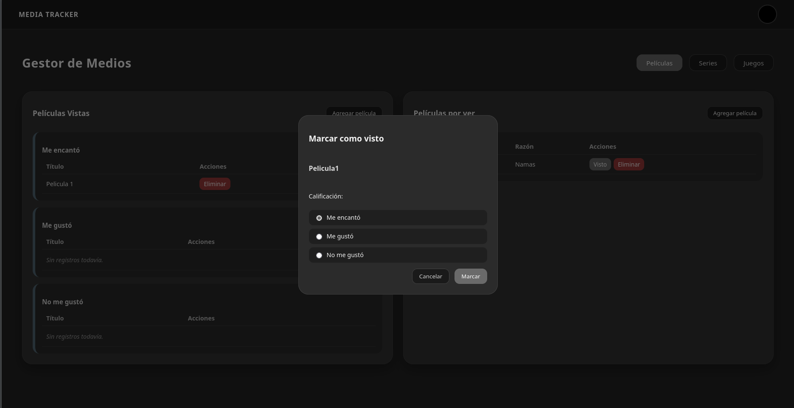

8. **Ítem actualizado**: evidencia del cambio aplicado en la interfaz.

   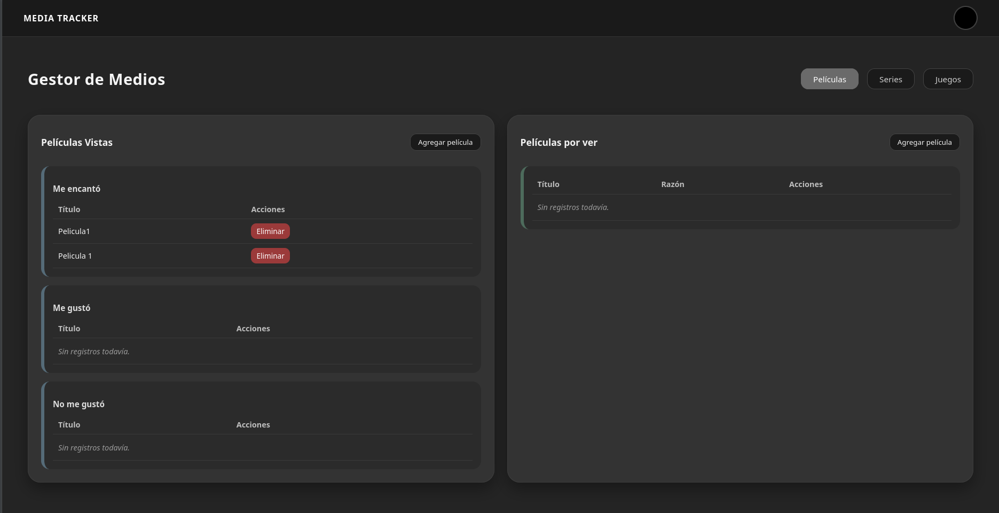

9. **Proceso de cierre de sesión**: invalidación de sesión y salida del panel.

   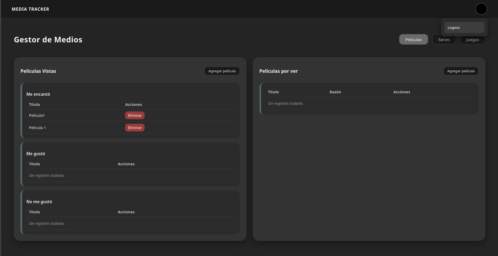

### 3) Flujo administrativo

10. **Login de administrador**: acceso con credenciales de rol admin.

    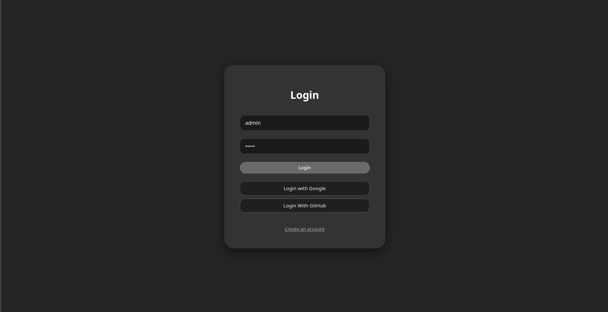

11. **Dashboard de administrador**: vista de administración de usuarios y recursos.

    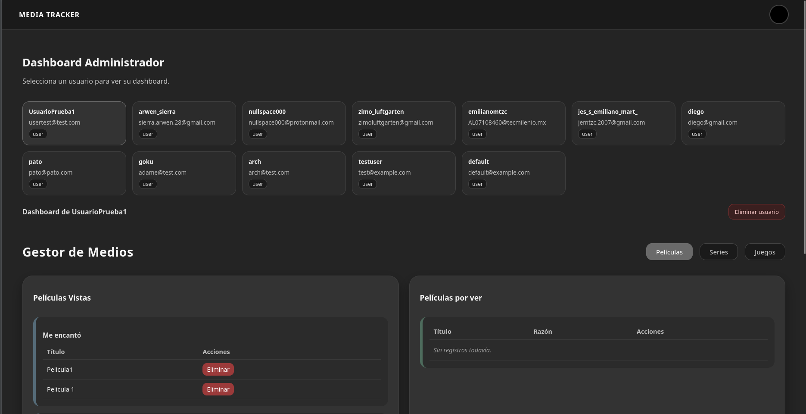

12. **Eliminación de usuario**: operación administrativa de borrado controlado.

    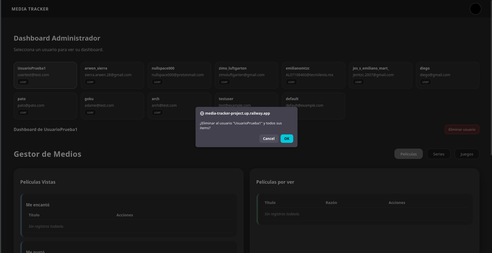

13. **Eliminación de ítem de un usuario**: administración de contenido asociado a cuentas.

    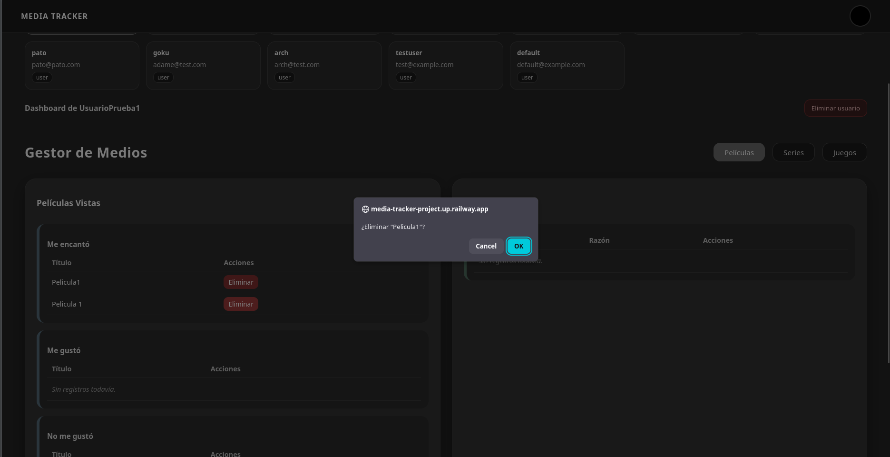

Estas capturas documentan los flujos clave de autenticación, gestión de sesión, operaciones CRUD del usuario y operaciones administrativas con control por roles.

---

## 📝 Licencia

Este proyecto está bajo la licencia MIT. Ver [`LICENSE`](LICENSE).
